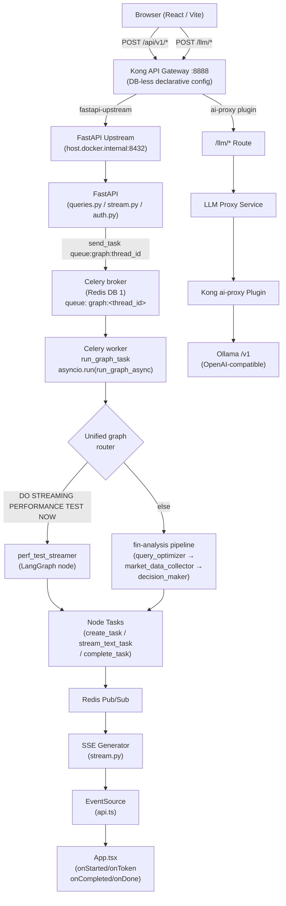
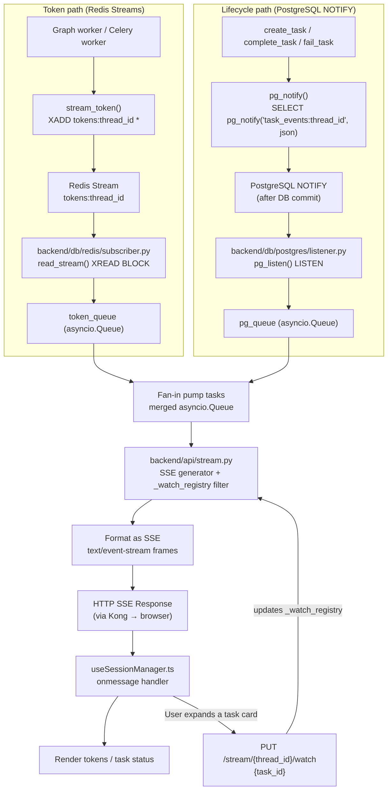

# E2E Flow — Architecture & Conventions

## Full pipeline overview



## Query dispatch — Celery per-thread queue

Every query (normal and perf-test) is dispatched to a **dedicated per-thread Celery queue**:

```
POST /api/v1/users/query
  └─ queries.py
       └─ celery_app.control.add_consumer("graph:<thread_id>")
       └─ celery_app.send_task(GRAPH_TASK_NAME, queue="graph:<thread_id>")
            └─ Celery worker: run_graph_task (asyncio.run)   [backend/graph/runner.py]
                 └─ run_graph_async → graph.ainvoke → LangGraph nodes
                      └─ LLM chain.astream() → stream_token() XADD tokens:<thread_id>
```

- **Per-thread isolation**: each query gets `queue="graph:<thread_id>"`. No two queries share a worker slot — a slow LLM call cannot block another query.
- `run_graph_task` lives in `backend/graph/runner.py` (task name: `backend.graph.runner.run_graph_task`). It wraps `run_graph_async` with `asyncio.run()`.
- The Celery app (`backend/streaming/celery_app.py`) always includes `backend.graph.runner` so `run_graph_task` is registered on every worker process.
- Streaming workers (`backend/streaming/workers/`) only handle Redis Stream consumers (graph_events, market_data, signals). Graph execution is **not** a streaming worker.
- Cancellation: `result.revoke(terminate=True, signal="SIGTERM")` — the `running_tasks` registry maps `thread_id → Celery AsyncResult`.
- The `_running_tasks` registry in `backend/api/registry.py` holds `AsyncResult` (Celery) only. The `is_task_active()` helper checks `result.ready()` for lazy GC.

## Kong API Gateway

### Config management

Kong runs in **DB-less mode** (`KONG_DATABASE=off`). All config lives in
`kong-api-gateway/kong.yml` (auto-generated — **do not edit directly**).

To add or change routes/plugins, edit the source fragments and regenerate:

```bash
python kong-api-gateway/build.py
```

Fragment directory layout:

```
kong-api-gateway/
  _shared/
    base.yml          # _format_version, _transform
    upstreams.yml     # fastapi-upstream (round-robin, health-check /health)
    services.yml      # fastapi + llm-proxy service stubs
    plugins.yml       # global plugins: CORS, rate-limiting, correlation-id
    dev_routes.yml    # /docs /redoc — remove in production
  api/v1/
    auth/routes.yml   # POST /api/v1/auth/*
    users/routes.yml  # POST|GET /api/v1/users/query/*
    stream/routes.yml # GET /api/v1/stream/* (SSE)
    reports/routes.yml
    tasks/routes.yml
    quant/routes.yml
  llm/
    routes.yml        # POST /llm/* → llm-proxy
    plugins.yml       # ai-proxy plugin (Ollama upstream)
```

### Services

| Service | Host | Purpose |
|---|---|---|
| `fastapi` | `fastapi-upstream` (port 80) | All REST + SSE routes |
| `llm-proxy` | `http://placeholder.invalid` | LLM pass-through; ai-proxy plugin overrides URL |

Both services use `write_timeout: 3600000` / `read_timeout: 3600000` (60 min) to
support long-running LLM streams.

### Key global plugins (`_shared/plugins.yml`)

| Plugin | Config highlights |
|---|---|
| `cors` | Allows `http://localhost:3000` (Vite dev); exposes `Last-Event-ID` for SSE reconnect |
| `rate-limiting` | 300 req/min, 5000/hr; Redis policy (DB 1); limit by IP |
| `request-size-limiting` | 10 MB max payload |
| `correlation-id` | Injects `X-Request-ID` (uuid#counter) into every response |

### SSE routes

SSE routes **must** set `response_buffering: false` so Kong forwards chunks
immediately without buffering the full response:

```yaml
- name: route-stream
  service: fastapi
  paths: [/api/v1/stream]
  response_buffering: false
```

The SSE client also sends `Last-Event-ID` on reconnect — this header is
whitelisted in the CORS plugin.

#### SSE streaming flow — dual-channel architecture



**Transmission split:**
- `token` events → **Redis Streams** (`XADD tokens:<thread_id>`) — high-throughput, no DB write
- `started / completed / failed / cancelled / done` → **PostgreSQL NOTIFY** (`pg_notify`) — fired after DB commit, payload carries authoritative data

**Watch-registry token filtering (`_watch_registry: dict[str, int]` in `stream.py`):**
- `token` events are **suppressed** unless the event's `task_id` matches `_watch_registry[thread_id]`.
- `PUT /api/v1/stream/{thread_id}/watch` `{"task_id": int | null}` — browser calls this when the user expands a task card. `null` unwatches.
- **Auto-watch**: when a live `started` event arrives and no watch is set, the SSE generator auto-registers that task (handles the single-task common case without any client action).
- **Late-connect auto-watch**: `_replay_existing()` also auto-registers the last `started` task seen during replay so token events flow for late-connecting clients.

**Late-connect replay (`_replay_existing` in `stream.py`):**
- On SSE connect, all existing `AgentTask` rows are loaded from PG and re-emitted as synthetic `started` / `completed` / `failed` pairs so the client gets full graph state immediately.
- After opening `LISTEN`, a second `_replay_existing()` call covers the race window between the first replay and when `LISTEN` became active.

**Orphan detection:**
- If `thread_id not in running_tasks` but DB shows `status='running'`, the query is an orphan (server restarted mid-run).
- Perf-test orphans → `status='cancelled'`; all other orphans → `status='failed'` with an error message.
- A `done` event closes the stream immediately in both cases.

**No external publish endpoint** — `POST /streaming/publish` has been removed. All Redis Stream writes happen in-process via `backend.db.redis.publisher.stream_token()`.

### LLM proxy route

```
POST /llm/v1/chat/completions
  → Kong ai-proxy plugin
  → Ollama http://{OLLAMA_HOST}:{OLLAMA_PORT}/v1  (OpenAI-compatible)
```

`strip_path: true` on route-llm-chat removes the `/llm` prefix before
forwarding. The `kong_ai` LLM provider in `backend/llm/providers/kong_ai.py`
targets `http://localhost:8888/llm/v1` in development.

### Kong / nginx as a streaming proxy — design considerations

Kong (and nginx underneath it) were designed for **short-lived HTTP request/response** cycles. They work for streaming, but require explicit configuration:

| Requirement | nginx directive | Kong equivalent |
|---|---|---|
| Disable response buffering | `proxy_buffering off` | `response_buffering: false` on the route |
| Long-lived connections | `proxy_read_timeout 3600` | `read_timeout: 3600000` on the service |
| SSE `Last-Event-ID` reconnect | allow in CORS headers | `Last-Event-ID` in CORS `headers:` list |

**What Kong is good for with streaming:**
- Routing, TLS termination, CORS, rate-limiting, correlation IDs — all work correctly on streaming responses because those are applied at connection time, not per-chunk.
- `response_buffering: false` makes Kong flush chunks immediately — no nginx proxy buffer accumulation.

**What Kong is NOT appropriate for with streaming:**
- Token-level fanout (one producer → N consumers). Kong is HTTP proxy, not a message broker. For that, use Redis Streams or Kafka directly.
- Ultra-high connection counts (>10k concurrent SSE). nginx/Kong has connection limits. At that scale, move to a dedicated WebSocket/SSE gateway (e.g., Centrifugo, Pushpin) backed by Redis Pub/Sub.

In this project: Kong handles the browser→FastAPI HTTP layer. The actual token streaming (LLM → Redis Streams → SSE) never goes through Kong — Kong only sees the initial SSE `GET` connection.

### Kong AI Gateway (`ai-proxy` plugin)

Kong AI Gateway is a set of Kong plugins that turn Kong into an LLM-aware reverse proxy:

| Feature | Description |
|---|---|
| **ai-proxy** | Routes `POST /llm/v1/chat/completions` to any LLM provider (Ollama, OpenAI, Anthropic, Azure, Gemini, etc.) using an OpenAI-compatible API surface |
| **API key injection** | Kong holds the upstream API keys; clients send a placeholder (`Bearer ollama`) — keys never leak to the client |
| **Provider abstraction** | Change the upstream model in `kong.yml` without touching application code |
| **Semantic caching** | (Enterprise) Cache embeddings of prompts; return cached responses for semantically similar queries |
| **Token-based rate limiting** | (Enterprise) Rate limit by LLM token count, not just request count |
| **Load balancing** | Round-robin across multiple LLM upstream targets |

**In this project** (`llm/plugins.yml`):
```yaml
- name: ai-proxy
  service: llm-proxy
  config:
    route_type: llm/v1/chat
    auth:
      header_name: Authorization
      header_value: "Bearer ollama"   # placeholder — Ollama doesn't validate keys
    model:
      provider: openai                 # Ollama is OpenAI-compatible
      name: "{OLLAMA_MODEL}"
      options:
        upstream_url: "http://{OLLAMA_HOST}:{OLLAMA_PORT}/v1"
```

The `kong_ai` LLM provider (`LLM_PROVIDER=kong_ai`) routes FastAPI's LangChain calls through Kong instead of directly to Ollama. This adds Kong's observability (Prometheus metrics, correlation IDs) to every LLM inference call. The `ollama` provider bypasses Kong entirely for lower latency in local dev.

**LLM traffic path by provider:**

| Provider | Path | Goes through Kong? |
|---|---|---|
| `ollama` | FastAPI → `http://127.0.0.1:11434/v1` directly | No |
| `kong_ai` | FastAPI → Kong `:8888/llm` → Ollama | Yes |
| `ark` | FastAPI → `https://ark.cn-beijing.volces.com/api/v3` via `HTTP_PROXY` | No |
| `gemini` | FastAPI → Google API via `HTTP_PROXY` | No |

Only `kong_ai` routes LLM traffic through Kong — the others connect directly. All four providers stream tokens in-process via `chain.astream()` and write to Redis Streams via `stream_token()`.

### Adding a new API route

1. Create `kong-api-gateway/api/v1/<domain>/routes.yml`:
   ```yaml
   routes:
     - name: route-<domain>
       service: fastapi
       paths: [/api/v1/<domain>]
       strip_path: false
       protocols: [http, https]
   ```
2. Run `python kong-api-gateway/build.py` to regenerate `kong.yml`.
3. Reload Kong: `docker compose restart kong` (DB-less config reloads on restart).

### Frontend base URL

`frontend/src/api.ts` uses:
```ts
const KONG_ORIGIN = import.meta.env.VITE_KONG_URL ?? "";   // empty = Vite proxy
const BASE = `${KONG_ORIGIN}/api/v1`;
```

In development, Vite proxy (`vite.config.ts`) forwards `/api` and `/llm` to
`http://localhost:8888` (Kong). In production, set `VITE_KONG_URL=http://<host>:8888`.

## Adding a new query-type shortcut

1. Define a constant trigger string in `backend/api/queries.py`:
   ```python
   _MY_TRIGGER = "MY TRIGGER PHRASE"
   ```
2. Create `backend/<feature>/runner.py` with `async def run_<feature>(thread_id)`.
3. In `run_query`, add a branch **before** the default `_run_graph` call:
   ```python
   if request.query.strip() == _MY_TRIGGER:
       task = asyncio.create_task(run_<feature>(thread_id))
   else:
       task = asyncio.create_task(_run_graph(thread_id, request.query))
   ```
4. The runner must mirror the `_run_graph` lifecycle:
   - `await asyncio.sleep(1)` — let SSE client connect
   - `start_node_execution` / `create_task` (provider="mock" or real)
   - `stream_text_task` or `stream_llm_task` for token events
   - `complete_task` / `finish_node_execution`
   - Update `UserQuery` status in DB
   - `await emit_done(thread_id, "completed")`
   - Handle `CancelledError` and generic exceptions the same way

## Adding a new LLM provider

1. Create `backend/llm/providers/<name>.py` with a `get_<name>_llm(temperature) -> BaseChatModel`.
2. Add the provider name to `_SUPPORTED_PROVIDERS` in `backend/llm/factory.py`.
3. Add a branch to `_build_provider()` in `factory.py`.
4. Add to `_FAILOVER_CANDIDATES` only if the provider supports cloud API failover.

## Task streaming conventions

All token events must use `backend/graph/utils/task_stream`:

```python
task_id = await create_task(thread_id, "node.task_key", node_execution_id, provider=provider)
full_text = await stream_text_task(thread_id, task_id, "node.task_key", async_gen)
await complete_task(thread_id, task_id, "node.task_key", {"summary": ...})
```

- `task_key` format: `<node_name>.<method>[.<symbol>]`
- `node_name` is always the first dot-segment — it drives the SSE `node_name` field
- Never write token events directly to DB; `stream_text_task` handles Redis Streams (XADD) only
- `pg_notify` is called automatically by `create_task`, `complete_task`, `fail_task`, `cancel_task`, `emit_done`
- Use `stream_llm_task` for `AsyncIterable[AIMessageChunk]`, `stream_text_task` for `AsyncIterable[str]`
- All of these functions live in `backend/sse_notifications/` — the central SSE notification package

## SSE event types (in order)

| Event | Payload fields | Frontend handler |
|---|---|---|
| `connected` | `thread_id` | — |
| `started` | `task_id, node_name, task_key, provider?` | `onStarted` |
| `token` | `task_id, node_name, task_key, data` | `onToken` |
| `completed` | `task_id, node_name, task_key, output` | `onCompleted` |
| `failed` | same as completed | `onFailed` |
| `cancelled` | same as completed | `onCancelled` |
| `done` | `status, report?` | `onDone` |
| `ping` | — | ignored |

## Frontend — wiring a new message type

1. If the new query produces a special UI (not a normal chat message), gate on the trigger in `App.tsx`:
   ```tsx
   if (query.trim() === MY_TRIGGER) {
     const res = await submitQuery(query, userToken!);
     setMyFeatureThreadId(res.thread_id);
     return; // skip normal SSE/message flow
   }
   ```
2. Render the dedicated component in `<Content>` with a conditional:
   ```tsx
   {myFeatureThreadId ? (
     <MyFeaturePanel initialThreadId={myFeatureThreadId} userToken={userToken!} initialCleanup={() => {}} />
   ) : (
     <MessageList ... />
   )}
   ```
3. Provide an "Exit" button that resets the feature state back to `null`.

## Key files

| File | Role |
|---|---|
| `kong-api-gateway/build.py` | Merges fragments → `kong.yml` |
| `kong-api-gateway/kong.yml` | Kong DB-less declarative config (auto-generated) |
| `kong-api-gateway/_shared/plugins.yml` | Global CORS / rate-limit / correlation-id |
| `kong-api-gateway/_shared/services.yml` | `fastapi` + `llm-proxy` service definitions |
| `kong-api-gateway/llm/plugins.yml` | ai-proxy plugin (Ollama upstream) |
| `backend/api/queries.py` | Query routing + `_run_graph` + cancel |
| `backend/sse_notifications/__init__.py` | Central SSE notification package — re-exports all public symbols |
| `backend/sse_notifications/schemas.py` | Pydantic payload models for every SSE event type |
| `backend/sse_notifications/channel.py` | `pg_notify()` transport + `notify_channel()` |
| `backend/sse_notifications/task_lifecycle.py` | `create_task`, `complete_task`, `fail_task`, `cancel_task`, `emit_done` — DB write + notify |
| `backend/sse_notifications/task_control.py` | Cancel/pass signals: `signal_task_control`, `TaskCancelledSignal`, `TaskPassSignal` |
| `backend/sse_notifications/token_stream.py` | `stream_llm_task`, `stream_text_task` — Redis Streams token publishing || `backend/graph/utils/execution_log.py` | Node-level timing rows |
| `backend/graph/builder.py` | LangGraph topology |
| `backend/llm/factory.py` | Provider resolution + failover |
| `backend/llm/providers/kong_ai.py` | LLM provider via Kong ai-proxy |
| `backend/db/redis/publisher.py` | `stream_token(thread_id, payload)` → Redis Streams XADD |
| `backend/db/postgres/notifier.py` | `pg_notify(thread_id, payload)` → PostgreSQL NOTIFY |
| `backend/api/stream.py` | SSE endpoint + `_watch_registry` token filter + replay for late clients |
| `backend/api/registry.py` | Shared `running_tasks: dict[str, asyncio.Task]` (writer=queries.py, reader=stream.py) |
| `frontend/src/api.ts` | `submitQuery`, `openStream`, `cancelQuery` |
| `frontend/src/App.tsx` | SSE handler wiring + message state |
