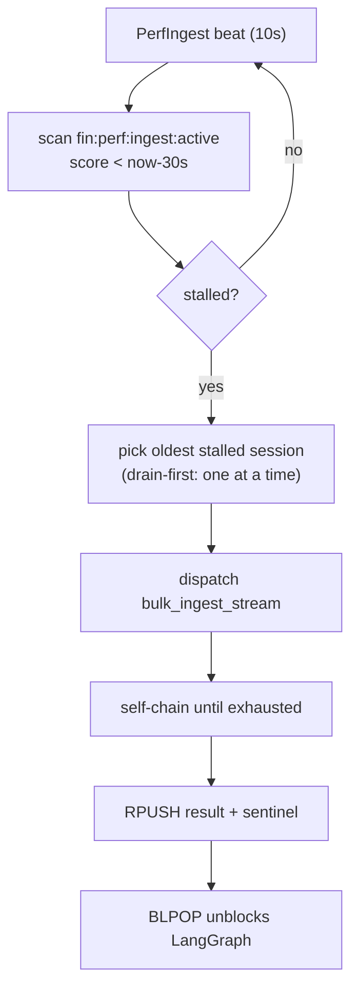
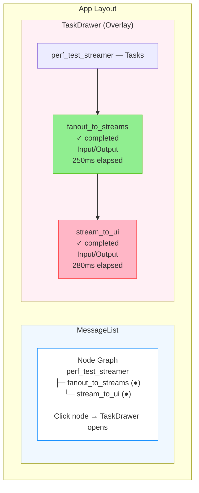

# Streaming Performance Test — Architecture & Guide

## Trigger phrase

Sending exactly `DO STREAMING PERFORMANCE TEST NOW` as a chat query activates the
streaming-perf-test path end-to-end. The constant `PERF_TEST_TRIGGER` is defined in
`backend/graph/builder.py` and exported from `backend/graph/__init__.py`.

## Architecture overview

Perf-test queries now go through the **same Celery per-thread queue mechanism** as
normal fin-analysis queries. There is no separate `_run_perf_graph` asyncio task.
The unified LangGraph graph routes internally based on the trigger phrase.

```
POST /query "DO STREAMING PERFORMANCE TEST NOW"
  └─ queries.py: apply_async(queue="graph:<thread_id>")  [same path as normal queries]
       └─ Celery run_graph worker  (broker DB 1, per-thread Redis List)
            └─ build_unified_graph()  → _route_query() → "perf_test_streamer"
                 └─ perf_test_streamer node  (LangGraph, sequential)
                      ├─ Phase 1: PERF_TEST_INGEST task (mock_ingest)
                      │    └─ run_ingest()
                      │         └─ PerfIngest Celery app  (broker DB 3, backend DB 4)
                      │               └─ bulk_ingest_stream()  — self-chain drain-first
                      │                    └─ Redis pipeline XADD → fin:perf:{thread_id}
                      │                         └─ RPUSH fin:perf:ingest:result:{thread_id}
                      │    └─ BLPOP awaits completion (no polling/sleep)
                      └─ Phase 2: PERF_TEST_PUB task (mock_pub)  ← created AFTER ingest
                           └─ perf_stream_reader_gen()  XREAD from fin:perf:{thread_id}
                                └─ stream_perf_text_task() → Redis Streams → SSE
                                     └─ emit_perf_test_complete/stopped() + emit_done()
```

## Unified graph routing (`build_unified_graph`)

`backend/graph/builder.py` defines `build_unified_graph()` — the single parent graph
used by all queries. `_route_query` is called at the START conditional edge:

```
START ──(query == PERF_TEST_TRIGGER?)──► perf_test_streamer ──► END
      └──────────────────────────────► query_optimizer → market_data_collector
                                              → decision_maker ──► END
```

`queries.py` always calls `_run_graph_task.apply_async(...)` — no `asyncio.create_task`
or perf-test-specific branching. Perf params (`total_tokens`, `timeout_secs`,
`num_of_requests`) are passed as Celery task kwargs and end up in `UnifiedGraphState`.

## Query-status phase tracking (`query_status` SSE event)

Under bulk simultaneous requests, requests can appear "stuck" because Celery workers
queue them invisibly.  A `query_status` SSE event is now emitted at every major phase
transition so the frontend grid shows exactly where each request is:

| Phase | Where emitted | Frontend status label |
|---|---|---|
| `received` | `queries.py` after `send_task` | Received (cyan) |
| `preparing` | `runner.py` start of `run_graph_async` (Celery worker picked up task) | Preparing (geekblue) |
| `ingesting` | `perf_test/node.py` before ingest phase | Ingesting (purple) |
| `sending` | `perf_test/node.py` before pub phase | Sending (blue) |

The phase is also stored in Redis (`fin:query:phase:{thread_id}`, TTL 600 s) so
late-connecting SSE clients recover the current phase via `_replay_existing` in
`stream.py`, even if they missed the original pg_notify event.

### Cleanup
- `runner.py`: calls `delete_query_phase` on task completion, cancellation, and error.
- `queries.py` cancel endpoint: calls `delete_query_phase` on explicit cancel.

### Key files
| File | Role |
|---|---|
| `backend/db/redis/query_phase.py` | `set_query_phase`, `get_query_phase`, `delete_query_phase` |
| `backend/sse_notifications/perf_test/notifications.py` | `emit_query_status` |
| `backend/api/queries.py` | emits `received` |
| `backend/graph/runner.py` | emits `preparing`, deletes phase on finish |
| `backend/graph/agents/perf_test/node.py` | emits `ingesting` and `sending` |
| `backend/api/stream.py` | reads Redis phase in `_replay_existing` |
| `frontend/src/api/stream.ts` | `onQueryStatus` handler in `openStream` |
| `frontend/src/components/StreamingPerfTestPanel/useBrowserStreamSession.ts` | phase → status mapping |
| `frontend/src/components/StreamingPerfTestPanel/useLocustStreamSession.ts` | phase → status mapping |

### Frontend status progression (ThreadSession.status)
```
connecting → received → preparing → ingesting → sending → completed/failed/stopped/cancelled
```
Status is NOT immediately set to "running" when SSE opens. It transitions via `query_status` events.
First `perf_token` received while still in a pre-sending state auto-advances to `"sending"`.

## Per-thread Celery queue isolation

Every query (normal and perf-test) gets its own Redis List on the broker:
- `queries.py`: `celery_app.control.add_consumer("graph:<thread_id>")` → `apply_async(queue="graph:<thread_id>")`
- `graph_runner.py` finally: `celery_app.control.cancel_consumer("graph:<thread_id>")` — cleans up after task ends

This ensures no head-of-line blocking between concurrent perf-test sessions.

## Sequential Two-Phase Architecture

The `perf_test_streamer` node runs two AgentTasks **sequentially**:

### Phase 1: `mock_ingest` (PERF_TEST_INGEST)

- Created **first** in the UI task sidebar.
- :func:`run_ingest` registers session state in Redis and dispatches
  `bulk_ingest_stream` to the **PerfIngest Celery app** (separate from main streaming).
- The Celery task bulk-writes tokens to `fin:perf:{thread_id}` via a Redis
  pipeline (no per-token await — pure sync XADD in batches of 10,000).
- **Drain-first via self-chaining**: each task invocation chains the next for
  the **same session** until `total_tokens` produced or `timeout_secs` elapses.
  No beat scheduling needed for normal operation.
- When done, appends an end-of-stream sentinel and RPUSH es a completion JSON
  to `fin:perf:ingest:result:{thread_id}`.
- LangGraph awaits via `redis.blpop(result_key, timeout=timeout_secs)` — no sleep.
- Ingest task is **completed** with `{total_generated, stop_reason, ingest_ms}`.

### Phase 2: `mock_pub` (PERF_TEST_PUB)

- Created **only after ingest completes** — UI shows two distinct task rows.
- :func:`perf_stream_reader_gen` XREADs from `fin:perf:{thread_id}` starting
  at `0-0` in batches of 1,000, yielding tokens until the sentinel is found.
- Fed into `stream_perf_text_task()` which emits `perf_token` SSE events.
- Pub task is **completed** with `{total_published, pub_ms, tps}`.

### Drain-first beat (stall recovery)

The PerfIngest Celery beat fires `recover_stalled_streams` every 10 seconds.
It scans `fin:perf:ingest:active` (sorted set, score = last heartbeat) and
picks the **single** oldest stalled session (no heartbeat for > 30 s).
Redispatching that one session allows its self-chaining to take over — only
one stalled session is recovered per beat cycle to maintain focus.



## PerfIngest Celery App (separate from main streaming)

| Property | Value |
|---|---|
| App name | `perf_ingest` |
| Module | `backend.graph.agents.perf_test.celery_ingest.celery_app` |
| Broker | Redis DB **3** (isolated from main streaming DB 1) |
| Backend | Redis DB **4** (isolated from main streaming DB 2) |
| Beat task | `recover_stalled_streams` every 10 s |

Starting the PerfIngest workers (from project root):
```bash
celery -A backend.graph.agents.perf_test.celery_ingest.celery_app.perf_ingest_app worker --beat --loglevel=info
```

## Redis key layout

| Key | Type | Purpose |
|---|---|---|
| `fin:perf:{thread_id}` | Stream | Token entries + sentinel |
| `fin:perf:ingest:state:{thread_id}` | Hash | `total_tokens, produced, status, started_at, timeout_secs, heartbeat` |
| `fin:perf:ingest:result:{thread_id}` | List | Completion JSON pushed by Celery, BLPOP'd by LangGraph |
| `fin:perf:ingest:active` | Sorted Set | `{thread_id: heartbeat_ts}` — used by beat recovery |


The delta between Task 1 and Task 2 elapsed times shows the back-pressure overhead
of Redis Pub/Sub and SSE processing.

### Code locations

| File | Role |
|---|---|
| `backend/graph/agents/perf_test/node.py` | `perf_test_streamer` with two-task logic |
| `backend/graph/agents/perf_test/tasks/fanout_to_streams.py` | Task 1 generator |
| `backend/graph/agents/perf_test/tasks/stream_to_ui.py` | Task 2 generator |
| `backend/graph/agents/task_keys.py` | `PERF_TEST_FANOUT`, `PERF_TEST_STREAM` |

### Task completion order

1. Task 1 (`fanout_to_streams`) completes → `complete_task` emits `completed` SSE
2. Task 2 (`stream_to_ui`) completes → `complete_task` emits `completed` SSE
3. Node execution finishes → answer summary shows both timings

## Frontend UI Changes

### Task Drawer in Perf Test Mode

When in perf-test mode, `App.tsx` uses the **existing `TaskDrawer` component** 
(same as normal mode). Clicking on the `perf_test_streamer` node opens the drawer
showing both tasks:



The existing `TaskDrawer` displays:
- Task label with status badge
- Task metadata (key, provider, timestamps)
- Input/Output sections
- Streaming output as it arrives

**Integration in `App.tsx`:**
- Both normal and perf-test modes use the same `TaskDrawer` component
- Clicking any node (perf_test_streamer or others) opens the drawer via `setDrawerNodeName`
- `handlePerfNodeClick` callback sets the drawer node name instead of toggling grid
- No custom UI logic needed for perf test tasks

## Updated Key Files

| File | Role |
|---|---|
| `backend/graph/builder.py` | `PERF_TEST_TRIGGER` constant + `build_unified_graph()` (routes fin vs perf) |
| `backend/graph/state.py` | `UnifiedGraphState` (merged state for both branches) |
| `backend/graph/runner.py` | `run_graph_task` Celery task (accepts perf kwargs, uses unified graph) |
| `backend/api/queries.py` | Always dispatches via `apply_async` to per-thread queue — no asyncio.Task path |
| `backend/graph/agents/perf_test/node.py` | Sequential ingest→pub node runner |
| `backend/graph/agents/perf_test/tasks/fanout_to_streams.py` | `run_ingest()` + `perf_stream_reader_gen()` |
| `backend/graph/agents/perf_test/celery_ingest/config.py` | PerfIngest constants (DB indices, key prefixes) |
| `backend/graph/agents/perf_test/celery_ingest/celery_app.py` | `perf_ingest_app` (broker DB 3, backend DB 4) |
| `backend/graph/agents/perf_test/celery_ingest/tasks.py` | `bulk_ingest_stream` + `recover_stalled_streams` |
| `backend/graph/agents/task_keys.py` | `PERF_TEST_INGEST`, `PERF_TEST_PUB` keys |
| `frontend/src/components/TaskDrawer/TaskDrawer.tsx` | Existing task sidebar (used for both normal & perf-test modes) |
| `frontend/src/App.tsx` | Perf test mode layout using existing TaskDrawer |

## 1 session on mount → 5 sessions on mount (auto-fanout)

On `StreamingPerfTestPanel` mount **five** sessions are opened concurrently:
`openSessionStream(initialThreadId)` for the first, then four more via
`submitQuery("DO STREAMING PERFORMANCE TEST NOW", userToken)` executed in
parallel with `Promise.all`.

```tsx
// In useEffect([])
openSessionStream(initialThreadId);   // session 1
// fire-and-forget async spawn for sessions 2-5
const label = `Stream #${labelCounter.current++}`;  // label computed OUTSIDE setSessions
setSessions((prev) => [...prev, { thread_id, label, ... }]);
openSessionStream(thread_id);
```

### React StrictMode guard (`didSpawnRef`)

`useEffect` uses `didSpawnRef` to prevent the double-mount from firing 4 extra backend
requests.  On the **second** (StrictMode remount) the guard fires but still:
1. Resets fanout timers.
2. Resets stream #1's metrics (`tokens`, `start_ms`, `closed`) in state.
3. Calls `openSessionStream(initialThreadId)` to reopen the SSE connection that was
   closed during React's cleanup-between-mounts.

### Label counter rules

- `labelCounter` is a `useRef` — persists across StrictMode remounts.
- **Always computed outside `setSessions` functional updaters.**  React StrictMode
  double-invokes functional state updaters; putting `labelCounter.current++` inside one
  would skip every other number (e.g. #1, #3, #5 …).
- Reset to `1` in `handleRestart` so restarted streams are renumbered from #1.

### `openStream` intentional-close contract (`api.ts`)

The cleanup function returned by `openStream` sets `closed = true` and calls
`es.close()` **without** calling `notifyClose()`.  This means `onClose` is
**never** triggered by an explicit `cleanup()` call — it only fires on genuine
unexpected connection drops (detected via `es.onerror` with `CLOSED` readystate).

This prevents the StrictMode cleanup-between-mounts from falsely marking
stream #1 as `"failed"` just because React tore down and re-mounted the effect.

## StreamingPerfTestPanel Features

### Constants
```ts
const TOTAL_TOKENS_PER_STREAM = 100_000;        // target per stream (DEFAULT_PERF_CONFIG)
const DEFAULT_TIMEOUT_SECS    = 60;             // default from DEFAULT_PERF_CONFIG
```

### Timeout behaviour
The safety timeout in `attachStream` is set to `config.timeoutSecs * 1000` ms — no extra buffer.
It fires only if the SSE connection stays open but neither `perf_test_stopped`, `perf_test_complete`,
nor `done` events arrive (silent network partition).  Normal termination cancels it via
`closeSession` → `clearTimeout` before it fires.

```ts
// In attachStream
const sessionTimeoutMs = config.timeoutSecs * 1000; // matches backend MockChatModel deadline
const tid = setTimeout(() => {
  cancelQuery(thread_id).catch(() => {});   // terminate action
  closeSession(thread_id, "completed");     // status = completed
}, sessionTimeoutMs);
```

### Table columns
| Column | Description |
|---|---|
| Stream | Label (Stream #1 …) |
| Status | Badge: Connecting / Running / Completed / Failed / Cancelled / Stopped |
| Tokens | Count of `token` events received |
| Progress | `tokens / 100,000` as % |
| Token Rate (tps) | Live tps based on elapsed time |
| Duration | Elapsed wall-clock time |
| **Backend Finish Time** | `elapsed_ms` from the backend `done` event (how long the Celery worker spent publishing all tokens). Shown as `Xs` for ≥1 s or `Xms` otherwise. |
| **Last Received Token** | Raw text of the most recently received token (updated every second) |
| Thread ID | Truncated UUID |
| Action | Per-row Stop button |

### Dashboard stats row
| Stat | Description |
|---|---|
| Total Tokens | Sum of all tokens across sessions |
| Active Streams | Count of non-closed sessions |
| Completed | Sessions with status="completed" |
| Avg Token Rate | Average tps across running sessions |
| **Tokens/sec** | Tokens received in the last second (all sessions combined) |
| **Peak tps** | Highest per-second token rate observed |

## Locust test package (`tests/streaming_perf/`)

```
tests/streaming_perf/
  locustfile.py          # entry point — PerfTestUser HttpUser
  config.py              # DEFAULT_HOST, wait times, smoke/soak/stress presets
  tasks/
    __init__.py
    chat_stream.py       # ChatStreamTasks TaskSet
```

### Running

```bash
locust -f tests/streaming_perf/locustfile.py \
    --host http://localhost:8888 \
    --users 5 --spawn-rate 5 --run-time 5m --headless
```

### What `ChatStreamTasks` measures

| Metric name | What it measures |
|---|---|
| `submit_latency` | POST /query → HTTP 200 (ms) |
| `stream_duration` | First SSE byte → `done` event (ms) |
| `token_count` | Number of `token` SSE events received |

All three are fired as `events.request` so they appear in Locust's stats table,
CSV exports, and any connected Grafana dashboard.

On `StreamingPerfTestPanel` mount **five** sessions are opened concurrently:
`openSessionStream(initialThreadId)` for the first, then four more via
`submitQuery("DO STREAMING PERFORMANCE TEST NOW", userToken)` executed in
parallel with `Promise.all`.

```tsx
// In useEffect([])
openSessionStream(initialThreadId);   // session 1
// fire-and-forget async spawn for sessions 2-5
const label = `Stream #${labelCounter.current++}`;  // label computed OUTSIDE setSessions
setSessions((prev) => [...prev, { thread_id, label, ... }]);
openSessionStream(thread_id);
```

### React StrictMode guard (`didSpawnRef`)

`useEffect` uses `didSpawnRef` to prevent the double-mount from firing 4 extra backend
requests.  On the **second** (StrictMode remount) the guard fires but still:
1. Resets fanout timers.
2. Resets stream #1's metrics (`tokens`, `start_ms`, `closed`) in state.
3. Calls `openSessionStream(initialThreadId)` to reopen the SSE connection that was
   closed during React's cleanup-between-mounts.

### Label counter rules

- `labelCounter` is a `useRef` — persists across StrictMode remounts.
- **Always computed outside `setSessions` functional updaters.**  React StrictMode
  double-invokes functional state updaters; putting `labelCounter.current++` inside one
  would skip every other number (e.g. #1, #3, #5 …).
- Reset to `1` in `handleRestart` so restarted streams are renumbered from #1.

### `openStream` intentional-close contract (`api.ts`)

The cleanup function returned by `openStream` sets `closed = true` and calls
`es.close()` **without** calling `notifyClose()`.  This means `onClose` is
**never** triggered by an explicit `cleanup()` call — it only fires on genuine
unexpected connection drops (detected via `es.onerror` with `CLOSED` readyState).

This prevents the StrictMode cleanup-between-mounts from falsely marking
stream #1 as `"failed"` just because React tore down and re-mounted the effect.

## Frontend StreamingPerfTestPanel (`frontend/src/components/StreamingPerfTestPanel.tsx`)

### Constants
```ts
const TOTAL_TOKENS_PER_STREAM = 100_000;        // target per stream (DEFAULT_PERF_CONFIG)
const DEFAULT_TIMEOUT_SECS    = 60;             // default from DEFAULT_PERF_CONFIG
```

### Timeout behaviour
The safety timeout in `attachStream` is `config.timeoutSecs * 1000` ms — no extra buffer.
Fires only on silent network partition; cancelled by normal SSE event flow.

```ts
// In attachStream
const sessionTimeoutMs = config.timeoutSecs * 1000;
const tid = setTimeout(() => {
  cancelQuery(thread_id).catch(() => {});   // terminate action
  closeSession(thread_id, "completed");     // status = completed
}, sessionTimeoutMs);
```

## perf_test_complete vs perf_test_stopped

| Event | When emitted | Frontend effect |
|---|---|---|
| `perf_test_complete` | `stop_reason == "completed"` — full token budget streamed | Closes that session as "completed"; captures `backend_elapsed_ms` |
| `perf_test_stopped` | `stop_reason == "timeout"` — deadline fired before token budget | Freezes ALL sessions (stop-all behaviour) |

Backend emits exactly one of the two after `complete_task`. The `done` event still
arrives afterwards and is a no-op for already-closed sessions.

### Table columns
| Column | Description |
|---|---|
| Stream | Label (Stream #1 …) |
| Status | Badge: Connecting / Running / Completed / Failed / Cancelled / Stopped |
| Tokens | Count of `token` events received |
| Progress | `tokens / 100,000` as % |
| Token Rate (tps) | Live tps based on elapsed time |
| Duration | Elapsed wall-clock time |
| **Backend Finish Time** | `elapsed_ms` from the backend `done` event (how long the Celery worker spent publishing all tokens). Shown as `Xs` for ≥1 s or `Xms` otherwise. |
| **Last Received Token** | Raw text of the most recently received token (updated every second) |
| Thread ID | Truncated UUID |
| Action | Per-row Stop button |

## Layout in perf-test mode

When in perf-test mode, `App.tsx` renders a three-section layout inside `Content`:

1. **Left section** (`flex: 1`): `MessageList` showing the perf-test thread's node
   graph (SSE `onStarted` / `onCompleted` events populate the nodes — tokens are NOT
   watched, so no flooding).
2. **Right section** (`width: 280px`): `PerfTestTaskSidebar` showing task metrics
   (elapsed time, throughput per task).
3. **Bottom section** (toggled): `StreamingPerfTestPanel` grid — toggled on/off by 
   clicking the `streaming_perf_test` node in the message list.

### Layout code
```tsx
<div style={{ flex: 1, display: "flex", gap: 16, overflow: "hidden", padding: "16px 20px" }}>
  {/* Message list with node graph */}
  <div style={{ flex: 1, overflow: "hidden", display: "flex", flexDirection: "column" }}>
    <MessageList messages={messages} onNodeClick={handlePerfNodeClick} />
  </div>
  
  {/* Task sidebar showing perf test task metrics */}
  {messages.length > 0 && messages[messages.length - 1]?.nodes && (
    <div style={{ width: 280, overflow: "hidden" }}>
      <PerfTestTaskSidebar tasks={messages[messages.length - 1]?.nodes[0]?.tasks || []} />
    </div>
  )}
</div>
```

### Dashboard stats row
| Stat | Description |
|---|---|
| Total Tokens | Sum of all tokens across sessions |
| Active Streams | Count of non-closed sessions |
| Completed | Sessions with status="completed" |
| Avg Token Rate | Average tps across running sessions |
| **Tokens/sec** | Tokens received in the last second (all sessions combined) |
| **Peak tps** | Highest per-second token rate observed |

## Locust test package (`tests/streaming_perf/`)

```
tests/streaming_perf/
  locustfile.py          # entry point — PerfTestUser HttpUser
  config.py              # DEFAULT_HOST, wait times, smoke/soak/stress presets
  tasks/
    __init__.py
    chat_stream.py       # ChatStreamTasks TaskSet
```

### Running

```bash
locust -f tests/streaming_perf/locustfile.py \
    --host http://localhost:8888 \
    --users 5 --spawn-rate 5 --run-time 5m --headless
```

## Key files

| File | Role |
|---|---|
| `backend/llm/providers/mock.py` | `MockChatModel` — async token generator used by the perf-test graph node |
| `backend/streaming/perf_test/runner.py` | `run_streaming_perf_test` — fire-and-forget Celery dispatcher |
| `backend/streaming/perf_test/__init__.py` | Package export |
| `backend/api/queries.py` | `_STREAMING_PERF_TEST_TRIGGER` detection + routing |
| `tests/streaming_perf/locustfile.py` | Locust entry point |
| `tests/streaming_perf/tasks/chat_stream.py` | `ChatStreamTasks` — auth + submit + SSE drain |
| `tests/streaming_perf/config.py` | Host / wait-time / run presets |
| `frontend/src/components/StreamingPerfTestPanel.tsx` | Interactive 5-stream grid |


`MockChatModel` is a `BaseChatModel` that:
- Streams tokens `mock_msg_<thread_id>_<seq_id> ` at ~20 tps (configurable `token_delay`)
- Runs the generator as a **separate `asyncio.Task`** feeding an `asyncio.Queue(maxsize=200)`
  so token production is fully decoupled from the FastAPI request coroutine
- Enforces a hard 5-minute timeout (`timeout_secs=300`)
- Propagates `asyncio.CancelledError` cleanly — the worker task is always cancelled in `finally`

### Timing logs emitted by `mock.py`

| Log key | Level | When |
|---|---|---|
| `[mock_llm] worker throughput seq_id=... tps=... q_size=...` | DEBUG | Every 100 tokens produced |
| `[mock_llm] timeout reached seq_id=... elapsed=...s tps=...` | INFO | Worker timeout |
| `[mock_llm] queue_wait_high wait_ms=... tokens_so_far=...` | WARNING | Consumer waited >50 ms for a token |
| `[mock_llm] stream cancelled tokens_yielded=... elapsed=...s` | DEBUG | Stream cancelled |

```python
from backend.llm.providers.mock import get_mock_llm
llm = get_mock_llm(thread_id="abc-123", token_delay=0.05)
async for chunk in llm._astream([]):
    print(chunk.message.content)
```

`MockChatModel` is **never** registered in `LLM_PROVIDER` and is never returned by
`get_llm()`. It is only instantiated directly inside `streaming_perf_test/runner.py`.

## Streaming-perf-test runner (`backend/streaming_perf_test/runner.py`)

`run_streaming_perf_test(thread_id)` is a drop-in replacement for `_run_graph`:

1. `[t0]` Build + compile the perf test LangGraph; invoke `perf_test_streamer` node.
2. `[t1]` `start_node_execution` + `create_task` → emits `started` SSE.
3. `[t2]` `fanout_to_streams_gen` + `stream_perf_text_task` run concurrently under `asyncio.gather`.
4. `[done]` `complete_task` output: `{"total_generated": N, "stop_reason": ..., "total_published": N, "elapsed_ms": N, "tps": N.NN}`
5. `emit_perf_test_stopped` → `emit_done` signal query completed.
6. `CancelledError` / `Exception` paths mirror `_run_graph` exactly.

No `asyncio.sleep` grace periods anywhere in the runner or graph path.

### Constants
```python
_STREAMING_PERF_TEST_TIMEOUT = 300.0
_STREAMING_PERF_TEST_NODE    = "streaming_perf_test"
_STREAMING_PERF_TEST_TASK_KEY = "streaming_perf_test"
```

The SSE stream produced is structurally identical to a real LLM run. The frontend
processes it with the same `onStarted` / `onToken` / `onDone` handlers.

## Locust test package (`tests/streaming_perf/`)

```
tests/streaming_perf/
  locustfile.py          # entry point — PerfTestUser HttpUser
  config.py              # DEFAULT_HOST, wait times, smoke/soak/stress presets
  tasks/
    __init__.py
    chat_stream.py       # ChatStreamTasks TaskSet
```

### Running

```bash
# Headless smoke run (2 users, 30s)
locust -f tests/streaming_perf/locustfile.py \
    --host http://localhost:8888 \
    --users 2 --spawn-rate 1 --run-time 30s --headless

# Interactive UI
locust -f tests/streaming_perf/locustfile.py --host http://localhost:8888
# then open http://localhost:8089
```

### What `ChatStreamTasks` measures

| Metric name | What it measures |
|---|---|
| `submit_latency` | POST /query → HTTP 200 (ms) |
| `stream_duration` | First SSE byte → `done` event (ms) |
| `token_count` | Number of `token` SSE events received |

All three are fired as `events.request` so they appear in Locust's stats table,
CSV exports, and any connected Grafana dashboard.

### SSE consumption pattern in Locust

```python
with self.client.get(f"/api/v1/stream/{thread_id}", stream=True, ...) as resp:
    for raw_line in resp.iter_lines():
        if not raw_line or not raw_line.startswith("data:"):
            continue
        payload = json.loads(raw_line[5:].strip())
        if payload.get("event") == "token":
            token_count += 1
        elif payload.get("event") == "done":
            break
```

## Frontend StreamingPerfTestPanel (`frontend/src/components/StreamingPerfTestPanel.tsx`)

### Props

```ts
interface StreamingPerfTestPanelProps {
  initialThreadId: string;   // first thread_id submitted by App
  userToken: string;         // for spawning additional requests
  initialCleanup: () => void; // App hands over SSE cleanup ownership
}
```

### Features

- **Interactive grid** (`antd Table`) — one row per concurrent stream:
  - Status badge, token count, % of total, token rate (tps), elapsed duration, thread ID (truncated)
  - Per-row **Stop** button
- **Aggregate statistics** (`antd Statistic`): total tokens, active streams, completed count, avg token rate
- **Add Request** button — calls `submitQuery("DO STREAMING PERFORMANCE TEST NOW")` then `openStream`, adds a new row
- **Stop All** button — closes all active SSE connections
- Auto-stop: each session cancels itself after 5 minutes via `setTimeout`
- Live refresh: `setInterval(1 s)` ticks while any session is active to keep rate/duration columns current

### Session lifecycle

```
submitQuery → openStream → onToken (increment counter) → onDone / timeout → closeSession
```

`closeSession` cancels the SSE `EventSource`, clears the 5-min timeout, and marks
the row with a final status (`stopped` / `completed` / `failed` / `cancelled`).

### App.tsx integration

```tsx
// In handleSubmit — detect trigger before normal flow
if (query.trim() === PERF_TEST_TRIGGER) {   // "DO STREAMING PERFORMANCE TEST NOW"
  const res = await submitQuery(query, userToken!);
  setPerfTestThreadId(res.thread_id);
  return;
}

// In <Content>
{perfTestThreadId ? (
  <StreamingPerfTestPanel key={perfTestThreadId} initialThreadId={perfTestThreadId} userToken={userToken!} initialCleanup={() => {}} />
) : (
  <MessageList ... />
)}
```

## SSE stream timing logs (`backend/api/stream.py`)

| Log key | Level | When |
|---|---|---|
| `[stream] first_token_forwarded wait_ms=...` | DEBUG | First token forwarded to client |
| `[stream] tokens_forwarded=... suppressed=... tps=...` | DEBUG | Every 200 forwarded tokens |
| `[stream] done tokens_forwarded=... suppressed=... elapsed=...s` | INFO | `done` event sent |

## Redis publish timing logs (`backend/graph/utils/task_stream.py`)

| Log key | Level | When |
|---|---|---|
| `[task_stream] slow_publish pub_ms=... token#=...` | WARNING | Single Redis publish >20 ms |
| `[task_stream] publish_stats tokens=... avg_pub_ms=... tps=...` | DEBUG | Every 200 tokens |
| `[task_stream] stream_text_task finished tokens=... avg_pub_ms=... tps=...` | DEBUG | Stream end |

## Key files

| File | Role |
|---|---|
| `backend/llm/providers/mock.py` | `MockChatModel` — async token generator |
| `backend/streaming_perf_test/runner.py` | `run_streaming_perf_test` — backend streaming lifecycle |
| `backend/streaming_perf_test/__init__.py` | Package export |
| `backend/api/queries.py` | `_STREAMING_PERF_TEST_TRIGGER` detection + routing |
| `tests/streaming_perf/locustfile.py` | Locust entry point |
| `tests/streaming_perf/tasks/chat_stream.py` | `ChatStreamTasks` — auth + submit + SSE drain |
| `tests/streaming_perf/config.py` | Host / wait-time / run presets |
| `frontend/src/components/StreamingPerfTestPanel.tsx` | Interactive grid component |
